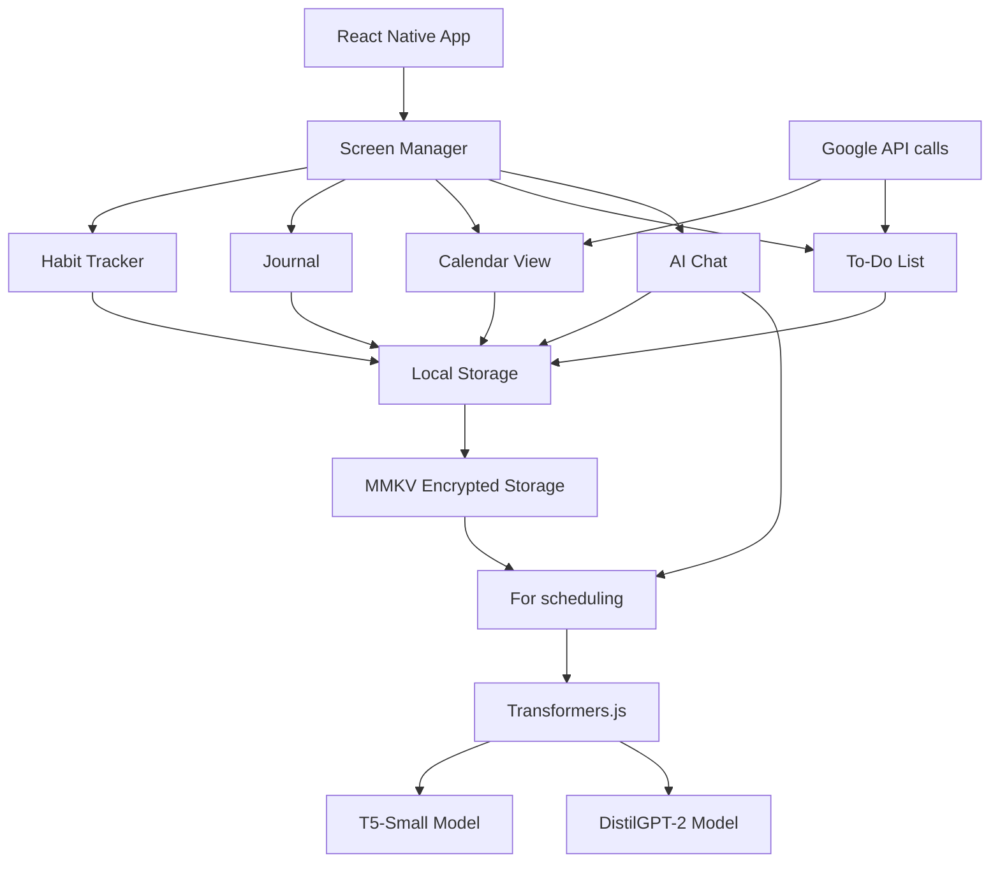

Mobile Architecture - Harmonious Day

System Overview



Data Flow

Daily Schedule Generation

1. Collect Inputs: Calendar events, Google Tasks, habits, Wu Xing phases
2. Build Prompt: Structured prompt for the scheduling model
3. AI Processing: Local model generates time-blocked schedule
4. Parse & Store: Parse AI response and store in local database
5. Display: Show schedule in Calendar screen with Wu Xing phase indicators

Habit Tracking

1. User Action: Toggle habit completion
2. Local Update: Update habit streak in local storage
3. AI Learning: Feed completion data to improve future scheduling
4. Notification: Schedule reminders for optimal habit times

Technology Stack

Frontend

· React Native 0.72 - Core framework
· Expo SDK 49 - Development platform
· NativeBase 3.4 - UI component library
· React Navigation 6 - Screen navigation
· Zustand - State management

AI & Processing

· Transformers.js - Local model inference
· T5-Small - Scheduling model (~150MB)
· DistilGPT-2 - Chat model (~350MB)
· Custom Prompt Engineering - Wu Xing optimization

Storage

· MMKV - High-performance local storage
· React Native AsyncStorage - Simple key-value storage
· AES-256 Encryption - Secure data storage

Integrations

· Google APIs - Calendar and Tasks
· Expo Notifications - Local reminders
· React Native SVG - Custom graphics

Screen Architecture

Base Screen Structure

```javascript
class BaseScreen extends React.Component {
  // Common functionality for all screens:
  // - Loading states
  // - Error handling
  // - Navigation integration
  // - Theme support
}
```

State Management

```javascript
// Global stores using Zustand
const useHabitStore = create((set, get) => ({
  habits: [],
  loadHabits: async () => { /* ... */ },
  toggleHabit: async (habitId) => { /* ... */ },
}));
```

Performance Considerations

Model Loading Strategy

· Lazy Loading: Models loaded on first use
· Caching: Model outputs cached when appropriate
· Background Processing: Schedule generation at 8PM daily

Memory Management

· Model Cleanup: Unload models when not in use
· Image Optimization: Compressed assets
· List Virtualization: For large habit lists

Security Architecture

Data Protection

· Local-Only: No data sent to external servers
· Encryption: Sensitive data encrypted at rest
· Permission Scoping: Minimal required permissions

AI Privacy

· On-Device Processing: All AI runs locally
· No Training Data: Models not updated with user data
· Opt-In Analytics: Anonymous usage data only with permission

---

docs/AI_INTEGRATION.md

Local AI Integration Guide

Overview

Harmonious Day uses local AI models for two main purposes:

1. Daily Schedule Generation - Creating optimal daily plans
2. AI Chat - Providing coaching and advice

Model Architecture

Scheduling Model (T5-Small Fine-tuned)

Purpose: Generate time-blocked daily schedules
Input:Calendar events, tasks, habits, Wu Xing phases
Output:Structured schedule with time allocations

```javascript
// Example prompt structure
const schedulingPrompt = `
Generate a daily schedule with the following constraints:

FIXED EVENTS:
- Meeting: 2:00 PM - 3:00 PM
- Lunch: 12:30 PM - 1:30 PM

TASKS:
- Complete project report (2 hours)
- Buy groceries (30 minutes)
- Call dentist (15 minutes)

HABITS:
- Meditation (15 minutes, optimal: wood phase)
- Exercise (45 minutes, optimal: fire phase)  
- Reading (30 minutes, optimal: water phase)

WU XING PHASES:
- Wood: 6:00 AM - 9:00 AM
- Fire: 9:00 AM - 12:00 PM  
- Earth: 12:00 PM - 3:00 PM
- Metal: 3:00 PM - 6:00 PM
- Water: 6:00 PM - 9:00 PM

PRAYER TIMES:
- Fajr: 5:31 AM
- Dhuhr: 1:15 PM

Generate a schedule that optimizes for:
1. Fixed event times
2. Task completion  
3. Habit placement in optimal phases
4. Prayer time accommodation
5. Natural energy flow

Output format:
TIME | ACTIVITY | TYPE [habit/task/fixed]
`;
```

Chat Model (DistilGPT-2)

Purpose: General conversation and coaching
Input:User message + context (current schedule, habits, etc.)
Output:Helpful response and advice

Implementation

Model Loading

```javascript
// src/services/ai/LocalAIService.js
import { pipeline } from '@xenova/transformers';

class LocalAIService {
  constructor() {
    this.schedulingModel = null;
    this.chatModel = null;
    this.isInitialized = false;
  }

  async initialize() {
    try {
      // Load scheduling model
      this.schedulingModel = await pipeline(
        'text2text-generation',
        'HarmoniousDay/t5-small-scheduling',
        { revision: 'main' }
      );

      // Load chat model  
      this.chatModel = await pipeline(
        'text-generation',
        'HarmoniousDay/distilgpt2-coach',
        { revision: 'main' }
      );

      this.isInitialized = true;
    } catch (error) {
      console.error('Failed to initialize AI models:', error);
    }
  }
}
```

Schedule Generation

```javascript
async generateDailySchedule(inputs) {
  if (!this.isInitialized) {
    await this.initialize();
  }

  const prompt = this.buildSchedulingPrompt(inputs);

  const output = await this.schedulingModel(prompt, {
    max_new_tokens: 512,
    temperature: 0.1,
    do_sample: false,
  });

  return this.parseSchedule(output[0].generated_text);
}
```

Response Parsing

```javascript
parseSchedule(aiOutput) {
  // Convert AI text response to structured schedule
  const lines = aiOutput.split('\n');
  const schedule = [];

  for (const line of lines) {
    const match = line.match(/(\d{1,2}:\d{2})\s*-\s*(\d{1,2}:\d{2}):\s*(.+?)\s*\[(\w+)\]/);
    if (match) {
      schedule.push({
        startTime: match[1],
        endTime: match[2], 
        activity: match[3],
        type: match[4]
      });
    }
  }

  return schedule;
}
```

Model Training

Fine-tuning Data

We fine-tune on synthetic scheduling examples:

```python
training_examples = [
    {
        "input": "Calendar: [Meeting 2-3pm], Tasks: [Write report 2h], Habits: [Meditate 15min wood], Phases: wood(6-9), fire(9-12)...",
        "output": "6:30-6:45: Meditation [habit], 9:00-11:00: Write report [task], 12:00-1:00: Lunch [fixed], 2:00-3:00: Meeting [fixed]"
    }
]
```

Performance Targets

· Schedule Generation: < 5 seconds on mid-range phones
· Chat Response: < 2 seconds
· Model Size: < 500MB total
· Accuracy: 85%+ optimal habit placement

Optimization Strategies

Model Quantization

```javascript
// Use quantized models for better performance
const model = await pipeline('text-generation', 'model-name', {
  quantized: true
});
```

Caching

```javascript
// Cache frequent schedule generations
const cacheKey = this.getScheduleCacheKey(inputs);
const cached = await this.cache.get(cacheKey);
if (cached) return cached;

const newSchedule = await this.generateDailySchedule(inputs);
await this.cache.set(cacheKey, newSchedule);
return newSchedule;
```

Background Processing

```javascript
// Generate next day's schedule at 8PM
Notifications.scheduleNotificationAsync({
  content: {
    title: "Tomorrow's schedule is ready!",
  },
  trigger: { 
    hour: 20, minute: 0, repeats: true 
  },
});
```

Error Handling

Fallback Strategies

```javascript
async generateScheduleWithFallback(inputs) {
  try {
    return await this.generateDailySchedule(inputs);
  } catch (error) {
    console.warn('AI generation failed, using rule-based fallback');
    return this.ruleBasedScheduler.generate(inputs);
  }
}
```

Model Recovery

```javascript
async recoverFromModelError() {
  this.schedulingModel = null;
  this.chatModel = null;
  this.isInitialized = false;

  // Clear model cache
  await AsyncStorage.removeItem('ai_models_cache');

  // Reinitialize
  await this.initialize();
}
```

---

docs/SCREENS.md

Screen Specifications

1. Habit Tracker Screen

Purpose

Track daily habits with optimal Wu Xing timing and build streaks.

Layout

```
┌─────────────────────────────────┐
│  Habits           [Add] [Filter]│
├─────────────────────────────────┤
│  Today's Habits                 │
│  ┌─ Habit 1 ──────────────────┐ │
│  │ 💪 Morning Exercise        │ │
│  │ ⭐⭐⭐⭐⚪ (4 day streak)   │ │
│  │ 🕗 Optimal: Wood (6-9 AM)  │ │
│  │ [ ] Complete               │ │
│  └────────────────────────────┘ │
│                                 │
│  ┌─ Habit 2 ──────────────────┐ │
│  │ 📚 Read 30min              │ │
│  │ ⭐⭐⚪⚪⚪ (2 day streak)   │ │
│  │ 🕗 Optimal: Water (6-9 PM) │ │
│  │ [✓] Completed              │ │
│  └────────────────────────────┘ │
│                                 │
│  Completed: 3/8 habits         │
└─────────────────────────────────┘
```

Components

· HabitList: Main list view with sections (Today, All Habits)
· HabitCard: Individual habit with streak, optimal time, completion
· HabitForm: Add/edit habit with Wu Xing phase selection
· HabitStats: Streak counters and completion analytics

State Management

```javascript
const useHabitStore = create((set, get) => ({
  habits: [],
  todayCompletions: {},

  loadHabits: async () => {
    const habits = await HabitRepository.getAll();
    set({ habits });
  },

  toggleHabit: async (habitId, date = new Date()) => {
    const completed = get().todayCompletions[habitId];
    await HabitRepository.toggleCompletion(habitId, date, !completed);

    set(state => ({
      todayCompletions: {
        ...state.todayCompletions,
        [habitId]: !completed
      }
    }));
  }
}));
```

2. Journal Screen

Purpose

Daily reflections with mood tracking and AI insights.

Layout

```
┌─────────────────────────────────┐
│  Journal         [New] [Calendar]│
├─────────────────────────────────┤
│  March 15, 2024                 │
│  Mood: 😊 😐 😢 😴 😡          │
│  ┌─ Today's Entry ────────────┐ │
│  │ [Text area for journal...] │ │
│  │                            │ │
│  │                            │ │
│  │                            │ │
│  └────────────────────────────┘ │
│                                 │
│  ┌─ AI Insights ──────────────┐ │
│  │ 💡 You've been consistent  │ │
│  │ with morning habits! Keep  │ │
│  │ up the great work.         │ │
│  └────────────────────────────┘ │
│                                 │
│  [Save Entry]  [AI Analysis]    │
└─────────────────────────────────┘
```

Features

· Mood Selector: 5-point mood scale with emojis
· Rich Text Editor: Basic formatting support
· AI Analysis: Local AI provides insights on entries
· Calendar View: Browse past entries by date
· Export: JSON/PDF export capabilities

3. Calendar View Screen

Purpose

Visualize and interact with the AI-generated daily schedule.

Layout

```
┌─────────────────────────────────┐
│  Today            [Regenerate]  │
├─────────────────────────────────┤
│  Wu Xing Phases:                │
│  ████▁▁▁ Wood (6-9) 75% complete│
│  ██████▁ Fire (9-12) In progress│
│  ▁▁▁▁▁▁ Earth (12-3) Upcoming   │
│  ▁▁▁▁▁▁ Metal (3-6)            │
│  ▁▁▁▁▁▁ Water (6-9)            │
│                                 │
│  ┌─ Daily Schedule ───────────┐ │
│  │ 6:30-7:00  Meditation     │ │
│  │ 7:00-8:00  Exercise       │ │
│  │ 9:00-11:00 Deep Work      │ │
│  │ 12:00-1:00 Lunch          │ │
│  │ 2:00-3:00  Meeting        │ │
│  │ 4:00-4:30  Groceries      │ │
│  │ 6:00-6:30  Reading        │ │
│  └────────────────────────────┘ │
│                                 │
│  [View Week] [Add Event]        │
└─────────────────────────────────┘
```

Interactive Elements

· Drag & Drop: Reschedule activities by dragging
· Phase Progress: Visual indicators for Wu Xing phase completion
· Quick Actions: One-tap rescheduling suggestions
· Conflict Detection: Visual warnings for schedule conflicts

4. To-Do List Screen

Purpose

Manage tasks from Google Tasks and local to-dos.

Layout

```
┌─────────────────────────────────┐
│  To-Do List      [Add] [Sync]   │
├─────────────────────────────────┤
│  Google Tasks ✓ Connected       │
│  ┌─ Task 1 ───────────────────┐ │
│  │ ⬜ Complete project proposal│ │
│  │   📅 Due: Today 5:00 PM    │ │
│  │   🕗 AI Suggests: 9-11 AM  │ │
│  └────────────────────────────┘ │
│                                 │
│  ┌─ Task 2 ───────────────────┐ │
│  │ ✅ Call dentist            │ │
│  │   📅 Completed: 10:00 AM   │ │
│  └────────────────────────────┘ │
│                                 │
│  Local Tasks                    │
│  ┌─ Task 3 ───────────────────┐ │
│  │ ⬜ Buy birthday gift       │ │
│  │   🎯 Priority: Medium      │ │
│  └────────────────────────────┘ │
└─────────────────────────────────┘
```

Integration Features

· Google Tasks Sync: Bi-directional sync with Google Tasks
· AI Scheduling: Suggested optimal times for tasks
· Priority Management: Eisenhower matrix integration
· Smart Lists: Today, Upcoming, Completed views

5. AI Chat Screen

Purpose

Get coaching and schedule advice from local AI.

Layout

```
┌─────────────────────────────────┐
│  AI Coach           [Settings]  │
├─────────────────────────────────┤
│  ┌─ Message 1 ────────────────┐ │
│  │ 🤖 How can I help with     │ │
│  │ your schedule today?       │ │
│  └────────────────────────────┘ │
│                                 │
│  ┌─ Message 2 ────────────────┐ │
│  │ 👤 I'm struggling with     │ │
│  │ morning routine            │ │
│  └────────────────────────────┘ │
│                                 │
│  ┌─ Message 3 ────────────────┐ │
│  │ 🤖 Try shifting meditation │ │
│  │ to 7:00 instead of 6:30... │ │
│  └────────────────────────────┘ │
│                                 │
│  ┌─ Type a message... ────────┐ │
│  │                            │ │
│  └────────────────────────────┘ │
│  [Send] [Quick Actions]         │
└─────────────────────────────────┘
```

Quick Actions

· Optimize Today: Regenerate schedule with current context
· Habit Advice: Get suggestions for habit formation
· Mood Check: AI analysis of recent journal entries
· Schedule Review: Identify scheduling conflicts or issues

Navigation Structure

```javascript
const AppNavigator = () => (
  <Tab.Navigator>
    <Tab.Screen name="Habits" component={HabitStack} />
    <Tab.Screen name="Journal" component={JournalStack} />
    <Tab.Screen name="Calendar" component={CalendarStack} />
    <Tab.Screen name="To-Do" component={TodoStack} />
    <Tab.Screen name="Chat" component={ChatStack} />
  </Tab.Navigator>
);

// Each tab has its own stack for detail screens
const HabitStack = () => (
  <Stack.Navigator>
    <Stack.Screen name="HabitList" component={HabitListScreen} />
    <Stack.Screen name="HabitForm" component={HabitFormScreen} />
    <Stack.Screen name="HabitStats" component={HabitStatsScreen} />
  </Stack.Navigator>
);
```

Screen Transitions

Shared Element Transitions

· Habit completion → Calendar schedule update
· Task creation → AI scheduling suggestion
· Journal entry → Chat screen context

Loading States

Each screen shows appropriate loading states:

· Skeleton screens for initial data load
· Progress indicators for AI processing
· Pull-to-refresh for data updates
